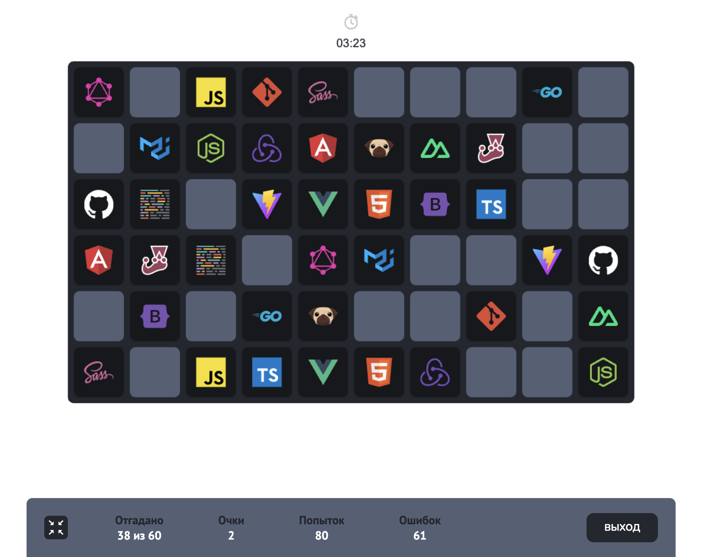

# Игра Memory: Запомни свой стек
Узнай, насколько хорошо ты можешь запоминать и сочетать пары!

## Видео-отчет (7-8 спринт): https://youtu.be/NAOpD6z2IWs

## Цель игры:
🔎 Найти все одинаковые пары карточек на игровом поле.

## Ход игры:

🟦 Игрок открывает две карточки за один ход.

✅ Если карточки имеют одинаковое изображение, они остаются открытыми.

❌ В противном случае они закрываются.

## Интерфейс:



### Как запускать?

1. Убедитесь что у вас установлен `node` и `docker`
2. Выполните команду `yarn bootstrap` - это обязательный шаг, без него ничего работать не будет :)
3. Выполните команду `yarn dev`
4. Выполните команду `yarn dev --scope=client` чтобы запустить только клиент
5. Выполните команду `yarn dev --scope=server` чтобы запустить только server

### Как запускать с базой для локальной разработки?

### Видео: https://youtu.be/JVSFwfT2PbE

1. Установить сервисы docker
2. Запустить сервисы adminer и pg-14
3. Выполните команду `yarn dev:server` чтобы запустить только server
4. Открыть приложение по адресу localhost:9000

### Как добавить зависимости?
В этом проекте используется `monorepo` на основе [`lerna`](https://github.com/lerna/lerna)

Чтобы добавить зависимость для клиента
```yarn lerna add {your_dep} --scope client```

Для сервера
```yarn lerna add {your_dep} --scope server```

И для клиента и для сервера
```yarn lerna add {your_dep}```


Если вы хотите добавить dev зависимость, проделайте то же самое, но с флагом `dev`
```yarn lerna add {your_dep} --dev --scope server```


### Тесты

Для клиента используется [`react-testing-library`](https://testing-library.com/docs/react-testing-library/intro/)

```yarn test```

### Линтинг

```yarn lint```

### Форматирование prettier

```yarn format```

### Production build

```yarn build```

И чтобы посмотреть что получилось


`yarn preview --scope client`
`yarn preview --scope server`

## Хуки
В проекте используется [lefthook](https://github.com/evilmartians/lefthook)
Если очень-очень нужно пропустить проверки, используйте `--no-verify` (но не злоупотребляйте :)

## Ой, ничего не работает :(

Откройте issue, я приду :)

## Автодеплой статики на vercel
Зарегистрируйте аккаунт на [vercel](https://vercel.com/)
Следуйте [инструкции](https://vitejs.dev/guide/static-deploy.html#vercel-for-git)
В качестве `root directory` укажите `packages/client`

Все ваши PR будут автоматически деплоиться на vercel. URL вам предоставит деплоящий бот

## Production окружение в докере
Перед первым запуском выполните `node init.js`


`docker compose up` - запустит три сервиса
1. nginx, раздающий клиентскую статику (client)
2. node, ваш сервер (server)
3. postgres, вашу базу данных (postgres)
4. adminer - ui клиент для удобной работы с бд
Если вам понадобится только один сервис, просто уточните какой в команде
`docker compose up {sevice_name}`, например `docker compose up server`

#### Локальная работа
При локальной работе с приложением в docker adminer доступен по адресу http://localhost:8080/

Чтобы достучаться до БД/сервера в локальной среде нужно указать в качестве адреса сеть docker (у меня 172.18.0.1) с соответствующим сервису портом.

#### Обновление отдельного сервиса
Для обновления сервиса `some_service` не нужно останавливать все контейнеры,
используйте команду:

`docker-compose build some_service &&
docker-compose stop some_service &&
docker-compose down some_service --rmi local --volumes --remove-orphans &&
docker-compose up -d some_service`

Так обновление пройдёт почти незаметно

#### Сделать дамп базы данных:

Ввести в командной строке в корне проекта команду
(к названию "dump.sql" дописывать дату экспорта)

`docker-compose exec -T mypg-14 sh -c 'exec pg_dump -U postgres --inserts bugsbase > /db/db-backups/dump.sql'`

#### Восстановить базу данных из дампа:

`docker-compose exec mypg-14 sh -c 'exec psql -U postgres bugsbase < db/db-backups/dump.sql'`